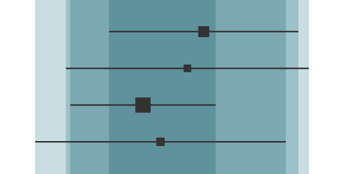
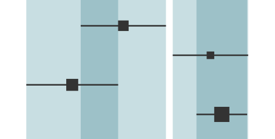

### How to interpret?

***

Heterogeneity bands augment classic forest plots to provide a better
visualization of heterogeneity between studies.

- There is a band for each study, and its width is equal to that of the
corresponding confidence interval.
- All bands are transparent and superimposed over each other to visualize
the overlap between intervals. Overlap between bands produces darker areas.
- A visual indication of homogeneity is when darker areas take larger
proportions of the total width.

Low heterogeneity:

High heterogeneity:

